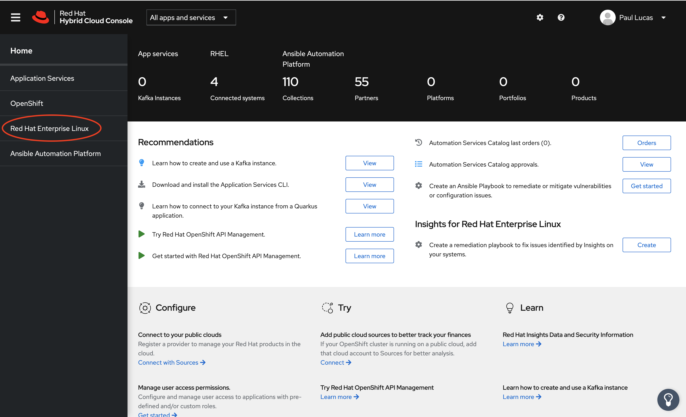

# Part 7: Provisioning a RHEL 8.3 VM from Satellite

[Tutorial Menu](https://github.com/pslucas0212/RedHat-Satellite-VM-Provisioning-to-vSphere-Tutorial)

Now that we have completed all of our prep work we can now provision VMs on VMWware based on specification we defined in the compute profile, which we created in an earlier section.  As part of the provisioning process Satellite will get an available IP address from our DHCP server, update the forward and reverse DNS zone records, and register the new RHEL VM to both our Satellite server and Red Hat Insights.

First make sure we have selected the Operations Department and moline for the orgainzation and location.  On the side menu chose Hosts -> Create Host.

On the All Hosts > Create Hosts page will start with the Host tab.  For this exercise I'm letting Satellite generate a random fully qualified domain name (FQDN) for the server, but you could of course enter a FQDN that follows your ogranization's server naming standards.  Chose the following options to complete this tab.

Option Name | Choice
----------- | ------
Host Group | hg-rhel8-prem-server

You will notice that all the other fields are automatically populated.  The Virtual Machine tab has been pre-populated with the information from the compute profile we created.  Please feel free to reveiw this tab.  Next we will choose the Operating System tab.

On the Operating System tab chose the following settings for the options listed below

Option Name | Choice
----------- | ------
Provisioning Method | Image Based
Image | img-rhel8-prem-server

Next click the Resolve button next to the Provisioning Templates option.  Make sure that you see the UserData open-vm-tools template.  Type in the root password for this system. 

Now click the Interfaces tab.  You should see that Satellite has already assigned an ip addressto our new RHEL VM.  You can now click the blue Submit button to start the provisioning process.

After clicking the blue Submit button, you will next see the steps in the provisioning process on the All Hosts > Create Host page.

After the RHEL VM has been provisioned and while the installation is completeing, you will see on the All Hosts screen for your new VM.  Now click the clear link found next to the Pending Installation for Build Properties field.

You will now see the the properties section has changed and the Status property is reporting an Error.  The Error indicates that there are available RHEL security errata that can be applied to our new RHEL VM.  Click the clear link next to the Security errata applicable staus found in the Errata property field to clear the Error status.  

On the side menu Hosts | Content Hosts to navigate to our newly provisioned VM.

On the Content Hosts page you will see that our VM is registered with Satellite and its most recent checkin date with our Satellite server.  Also you will see the number of installable updates available.  We will cover installing updates and patches in a future tutorial.

Let's make sure our new RHEL VM is registered to Insights.  Navigate to the [Red Hat Hybrid Cloud](https://cloud.redhat.com/) and login.  Click on the Console log in link in the upper right and corner and follow the Red Hat login and password prompts.

Now you will be at the Red Hat Hybrid Cloud Console. On the Hybrid Cloud Console you'll see a dashboard for RHEL, Red Hat App services, Ansbile Automation Platform and OpenShift.  Also you'll find recommended tools and articles for you to explore.

On the side menu click the Red Hat Enterprise Linux link.

Now we will see the Red Hat Enterprise Linux Insights page.  ???? Say something else here???  On the side menu, click the Inventory link.

On in the Inventory page, we see that our VM has been successfuly registered with Insights.  We will look at... in a future blog.

## References  
[Installing Satellite Server from a Connected Network](https://access.redhat.com/documentation/en-us/red_hat_satellite/6.9/html/installing_satellite_server_from_a_connected_network/index)   
[Simple Content Access](https://access.redhat.com/articles/simple-content-access)  
[Provisioning VMWare using userdata via Satellite 6.3-6.6](https://access.redhat.com/blogs/1169563/posts/3640721)  
[Understanding Red Hat Content Delivery Network Repositories and their usage with Satellite 6](https://access.redhat.com/articles/1586183)

